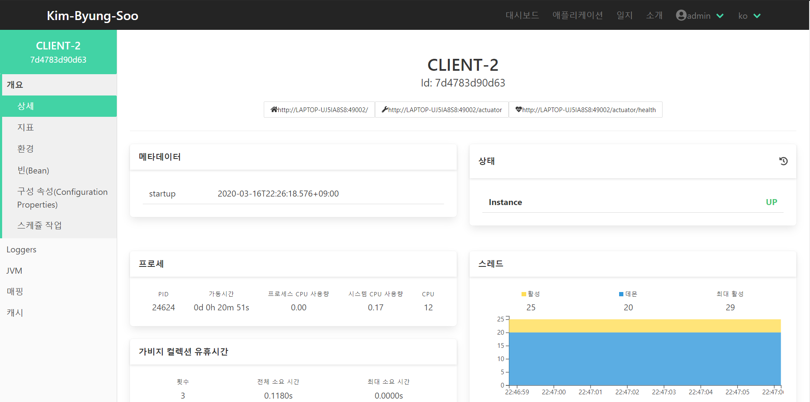

# Spring Boot Admin Server / Client TEST

> ## 우선 참고
> * https://www.baeldung.com/spring-boot-admin
> * https://codecentric.github.io/spring-boot-admin/current/
---
- 로그인 페이지

---
- 대시보드 탭

---
- 어플리케이션 탭

---
- 인스턴스


---

- 이번 기회에 Admin Server, Admin Client 로 Docker 공부 해보기
```
도커 사용법 및 실행방법은 다른 md 파일로 링크 예정 (일단 도커부터 공부)
```